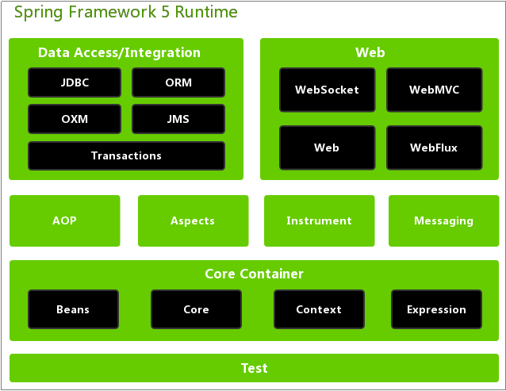
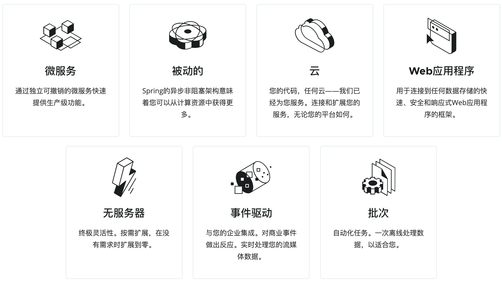

## spring模块

### 1. 核心容器模块

由spring-beans、spring-core、spring-context和spring-expression(Spring Expression Language，SpEL)四个模块组成。

### 2. AOP模块

由spring-aop、spring-aspects和spring-instrument

### 3. 数据访问和集成

由spring-jdbc、spring-orm、spring-oxm、spring-jms和spring-transactions五个模块组成。

### 4. web模块

由spring-web、spring-websocket、spring-webmvc和spring-webflux

### 5. 通信报文模块

spring-messaging

### 6. 测试模块

spring-test

## spring可以做什么

## BeanFactory 和 ApplicationContext 区别

| BeanFactory              | ApplicationContext     |
| ------------------------ | ---------------------- |
| 懒加载                   | 即时加载               |
| 使用语法显示提供资源对象 | 自己创建和管理资源对象 |
| 不支持国际化             | 支持国际化             |
| 不支持基于依赖的注解     | 支持基于依赖的注解     |

## spring中bean的几种scope

| singleton      | 单例，每一个个bean只创建一个对象实例                         |
| -------------- | ------------------------------------------------------------ |
| prototype      | 原型，每次请求都会产生一个新的实例                           |
| request        | 请求，每一次 HTTP 请求都会产生一个新的实例，并且该 bean 仅在当前 HTTP 请求内有效 |
| session        | 会话，每一次 HTTP 请求都会产 生一个新的 bean，同时该 bean 仅在当前 HTTP session 内有效 |
| global-session | 在一个全局的http session，一个bean定义对应一个bean实例， 不 过 它 仅 仅 在 基 于 portlet 的 web 应 用 中 才 有 意 义。 |

## spring bean生命周期

1. Bean实例化：spring启动后，会对bean进行实例化
2. Bean属性注入：将值和bean的引用注入到对应的bean属性中
3. BeanNameAware的setBeanName()方法调用：如果bean实现了BeanNameAware接口，spring将bean的id传递给setBeanName()方法，并调用该方法
4. BeanFactoryAware的setBeanFactory()方法调用：如果bean实现了BeanFactoryAware接口，spring将BeanFactory容器传递给setBeanFactory()方法，并调用该方法
5. ApplicationContextAware的setApplicationContext()方法调用：如果bean实现了ApplicationContextAware接口，spring将ApplicationContext容器传递给setApplicationContext()方法，并调用该方法
6. BeanPostProcessor的postProcessBeforeInitialization()方法调用：如果bean实现了BeanPostProcessor接口，将调用postProcessBeforeInitialization()方法
7.  被@PostConstruct注解标识的方法调用：当bean某个方法被@PostConstruct注解标识，将调用该方法
8. InitializingBean的afterPropertiesSet()方法调用：如果bean实现了InitializingBean接口，将调用afterPropertiesSet()方法；类似的，如果Bean使用init-method生命了初始化方法的话，该也会被调用。
9. BeanPostProcessor的postProcessAfterInitialization()方法调用：如果bean实现了BeanPostProcessor接口，将调用postProcessAfterInitialization()方法
10. bean准备就绪：bean此时已经准备就绪，可以被应用程序使用了，他们将一直驻留在应用的上下文中，直到应用的上下文被销毁
11. DisposableBean的destroy()方法调用：如果Bean实现DisposableBean接口，在销毁对象时将调用destroy()方法；同时，如果Bean使用了destory-method声明了销毁方法，该方法也会被调用。

